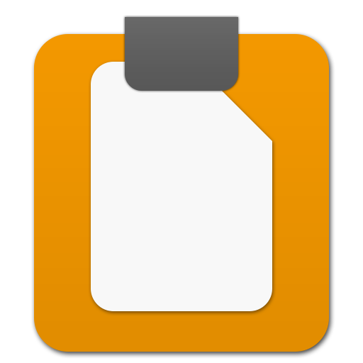
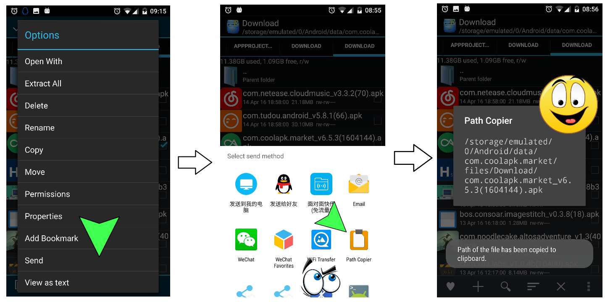

# Path Copier

### Description

Need to copy file paths often? If yes, the Android app is developed for you. Try it!

### How to use?
* Download and install it.
* `Share`/`Send` the target file to Path Copier.
* OK.

Notice that, the app has no icon in the Launcher.

### Download APK

* Get it
   * on [Google Play](https://play.google.com/store/apps/details?id=com.by_syk.pathcopier "Path Copier")
   * on [Cool Market](http://www.coolapk.com/apk/com.by_syk.pathcopier "Path Copier")
   * [here](com.by_syk.pathcopier.apk "Path Copier")

### Download AAR

* Get it [here](urianalyser-1.0.1.aar "UriAnalyser").

### Changelog

* View it [here](CHANGELOG.txt "Changelog").

### Contact author

* E-mail: [By_syk@163.com](mailto:By_syk@163.com "By_syk")

*Copyright &#169; 2016 By_syk. All rights reserved.*